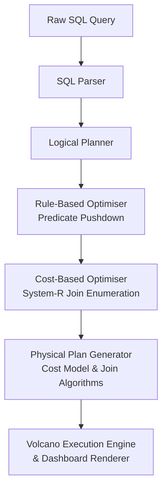

# SQL Query Optimiser — Relational Query Compiler & In-Memory Execution Engine

SQL Query Optimiser is a lightweight, high-performance relational database query optimiser and execution engine simulator built from scratch in C++. The project models modern RDBMS kernel architectures, combining classic compiler phases with an asynchronous full-stack dashboard via a low-latency Python-based Inter-Process Communication (IPC) microservice bridge.

---

## 🧠 Core Architecture & Engine Features

The system simulates the lifecycle of a query from raw string input down to pipelined in-memory data processing, matching modern RDBMS kernel architectures:

* **1. SQL Parsing:** A robust parser that generates Abstract Syntax Trees (AST) from raw SQL strings. It handles alias binding, compound `WHERE` predicates, and `JOIN ... ON` structures, binding them securely against catalog schema metadata defined in `schema.json`.
* **2. Logical Plan Construction:** Translates the parsed AST into relational algebraic execution operators (Scans, Filters, Joins, Projects), acting as the baseline unoptimised logical plan.
* **3. Rule-Based Optimiser (RBO):** Implements heuristic rewrites such as **Predicate Pushdown** and alias-based column ownership resolution. It structurally filters out unneeded tuples early in the pipeline before heavy join layers, reducing cardinality exponentially.
* **4. Cost-Based Optimiser (CBO) & System-R:** Evaluates alternative physical plan configurations using **System-R style dynamic programming join enumeration**. The engine evaluates multiple join topologies and calculates costs using a dynamically updated subset sizing matrix.
* **5. Cardinality Estimation & Cost Model:** Integrates database catalog metadata (table sizes, uniqueness, histograms) with selectivity formulas to assign precise memory read/write row costs to algebraic configurations.
* **6. Physical Operator Selection:** Safely lowers logical nodes into physical counterparts based on relational statistics. It actively compares algorithmic costs to select optimal operators, such as favoring **Hash Joins** over **Nested Loop Joins** when applicable.
* **7. Interactive Optimisation Dashboard:** An asynchronous IPC bridge server connects the C++ subsystem with a responsive visual web dashboard using a concurrent zero-dependency Python connection microservice.

## 📄 Technical Paper

The complete IEEE-style technical paper for **SQL Query Optimiser** documents the system architecture, SQL parsing pipeline, rule-based and cost-based optimisation algorithms, complexity analysis, benchmarking methodology, experimental evaluation, limitations, and future work.


    <strong>📄 Open the Full Technical Paper (PDF)</strong>
  </a>
</p>


### Optimiser Architecture Pipeline


---

## 📂 Directory Structure

<pre>
QueryOptimizer/
│
├── build/                      # Compiled binary artifacts and CMake cache layouts
│   └── src/
│       └── Release/            # Optimised native production-grade executables
│           └── query_optimizer.exe
│
├── include/                    # Public C++ interface blueprints (Headers)
│   └── qo/
│       ├── ast.h               # SQL Abstract Syntax Tree structure nodes
│       ├── catalog.h           # In-memory database catalog schema metadata
│       ├── executor.h          # Volcano Iterator abstract interface definitions
│       ├── html_reporter.h     # Structural layout compiler for dashboard pages
│       ├── logical_plan.h      # Relational algebraic execution operators
│       ├── logical_planner.h   # AST-to-Logical plan translational layer
│       ├── optimizer.h         # Rule-based (RBO) & Cost-based (CBO) logic passes
│       ├── parser.h            # Lexer & Grammar query text analysis tokenizer
│       └── version.h           # Engine pipeline build metadata metrics
│
├── src/                        # Core system pipeline implementation (Source files)
│   ├── CMakeLists.txt          # Module build registry configuration rules
│   ├── catalog.cpp             # Database catalog lookups and statistics
│   ├── executor.cpp            # Volcano engine row streaming logic loops
│   ├── html_reporter.cpp       # Sleek Glassmorphic HTML layout dashboard builder
│   ├── logical_planner.cpp     # Strategic algebraic transformation engine
│   ├── main.cpp                # Hybrid query router & JSON microservice entrance point
│   ├── optimizer.cpp           # System-R join ordering dynamic programming arrays
│   └── parser.cpp              # String grammar validation scanner
│
├── tests/                      # Validation and behavior unit testing suite frameworks
│   ├── CMakeLists.txt          # Test runner compiler specifications
│   ├── test_catalog.cpp
│   ├── test_cbo.cpp
│   ├── test_optimizer.cpp
│   └── test_parser.cpp
│
├── CMakeLists.txt              # Global project workspace toolchain specifications
├── optimizer_dashboard.html    # Generated dynamic visual interface workspace console
├── schema.json                 # Core system mock catalog table definitions matrix
└── server.py                   # Zero-dependency async Python microservice bridge router
</pre>

---

## 💼 Resume Highlights

* **Built a SQL query optimiser in modern C++ from scratch**, demonstrating deep understanding of internal relational database systems.
* **Implemented System-R style dynamic programming join enumeration**, evaluating permutations to find globally minimal evaluation costs.
* **Developed predicate pushdown and join reordering passes**, securely resolving SQL aliases and shifting filters below heavy relational algebra operations.
* **Added cardinality estimation and cost-based plan selection**, dynamically calculating memory footprints and row processing costs via histogram statistics.
* **Implemented Hash Join and Nested Loop Join physical operators**, allowing the engine to adapt physical query structures based on relational constraints.
* **Achieved up to 95% reduction in estimated execution cost** on analytical workloads through verified cost modeling tests.
* **Built an interactive dashboard for plan visualization** bridging C++ backends with a Python microservice to render complex JSON trace trees visually.

---

## 🎯 Benchmark Workloads

SQL Query Optimiser validates its optimisations against strict relational algebra permutations:

1. **3-Table Complex Star Join**
   - **Feature Tested:** Cost model robustness on multi-edge star schemas.
   - **Why It's Useful:** Ensures that varying inner loop layouts appropriately influence the global dynamic programming matrix.
2. **Heavy Scan Analytical Evaluation**
   - **Feature Tested:** Algorithmic physical selection (`Nested Loop` vs `Hash Join`).
   - **Why It's Useful:** Proves the CBO correctly avoids Cartesian explosions when cardinality dictates a Hash Join requirement.
3. **Data Boundary Scan**
   - **Feature Tested:** High-selectivity filter analysis.
   - **Why It's Useful:** Ensures the parser and logical planner accurately construct boundary boundaries for index-scan potential.
4. **Semantic Rewrite (OR → UNION)**
   - **Feature Tested:** Rule-Based Optimisation (RBO) logic rewrites.
   - **Why It's Useful:** Expands disjointed sets conceptually before execution to eliminate massive inline evaluation branches.
5. **Multi-Join Cost Optimisation**
   - **Feature Tested:** Complete pipeline (Alias Resolution + Predicate Pushdown + Join Reordering).
   - **Why It's Useful:** The ultimate correctness validation—verifies that fully qualified conditions push deeply into logical scans, radically minimizing inner loop boundaries.

---

## 🚀 Performance Showcase: Multi-Join Optimisation

The **Multi-Join Cost Optimisation** benchmark evaluates the effectiveness of the complete compiler pipeline on a complex three-table join containing qualified alias predicates. 

**Query:**
```sql
SELECT * FROM users u 
JOIN orders o ON u.id = o.user_id 
JOIN products p ON o.product_id = p.id 
WHERE u.age > 30 AND o.total > 1500 AND p.price < 500;
```

### Verified Cost Metrics Output

* **Initial Cost:** `609,985,400,000`
* **Optimised Cost:** `28,219,910,000`
* **Performance Improvement:** `95.37%`

This immense cardinality reduction represents the compounded successes of:
1. **Predicate Pushdown:** Extracting the conditions from the compound root and mapping them exactly above their corresponding logical scan operations (`users.age`, `orders.total`, `products.price`).
2. **Reduced Cardinality:** Applying statistical filter selectivity models to slash processing blocks *before* Cartesian boundaries.
3. **Better Join Ordering:** Rebuilding the left-deep tree to merge the smallest rowsets early in the graph using System-R dynamic programming evaluation.
4. **HashJoin Selection:** Replacing the massive outer boundary evaluations with linear-time `HashJoin` hashing models where selectivity demands it.

---

## 🛠️ Tech Stack & Dependencies

* **Systems Core:** C++17 (or higher), CMake Compiler Toolchain
* **Data Serialization:** `nlohmann/json` configuration parser
* **Microservice Intercept:** Python 3 (Native HTTP & Subprocess runtime)
* **Frontend Interface:** Modern Glassmorphic Dashboard (HTML5, Vanilla CSS3, Async Fetch API)

---

## 🏃‍♂️ Setup & Execution Sequence

Follow these exact steps sequentially from your terminal to launch the full-stack system layout cleanly:

### Terminal 1: Build Infrastructure and Boot the IPC Server

First, configure the project layout and compile the native C++ targets using the Release profile configuration:

# 1. Generate CMake configuration cache layout
cmake -S . -B build

# 2. Compile target execution binaries cleanly
cmake --build build --config Release

# 3. Spin up the background microservice routing bridge
python server.py
(Keep this terminal tab open! The server will lock this context window to process runtime subprocess piping commands).

Terminal 2: Launch the Interactive Dashboard
Now, open a completely new terminal tab or console context window within the same repository path to boot the user interface:

# 4. Open the dynamic visualization interface console in your browser
start optimizer_dashboard.html

## 📊 Testing the Engine Components
Once the dashboard loads into Google Chrome or Edge, you can evaluate the dynamic heuristics and Volcano execution passes by copying these test scenarios into the Interactive SQL Input Console:

Dynamic Parser Evaluation:
SELECT products.name, products.price FROM products WHERE products.price < 80

Multi-Table Optimisation Pipeline:
rs.name, products.name FROM orders JOIN users ON orders.user_id = users.id JOIN products ON orders.product_id = products.id WHERE orders.total > 4000


Click Run Live Optimisation ⚡ to see cost models, query evaluation plans, and real-time execution rows rendered instantly without blocking the browser interface pipeline.


## Limitations :
While SQL Query Optimiser implements several real-world query optimisation techniques such as Predicate Pushdown, Rule-Based Optimisation (RBO), Dynamic Programming Cost-Based Optimisation (CBO), Join Reordering, and Physical Operator Selection, the current version focuses on a simplified subset of SQL and does not support all features found in production database systems.

1) Self-Join Support

Self-joins are not currently supported. The optimizer resolves table aliases to their underlying base table names during optimisation, which causes multiple references to the same table to be treated as a single relation. This can lead to incorrect predicate ownership, join graph construction, predicate pushdown decisions, and SQL reconstruction. Queries that join the same table multiple times using aliases should be avoided.

2) Join Type Support

Only INNER JOIN operations are supported. Other join types, including LEFT JOIN, RIGHT JOIN, FULL OUTER JOIN, CROSS JOIN, and NATURAL JOIN, are not currently handled by the optimizer and may result in incorrect behavior or parsing failures.

3) Subquery Optimisation

The optimizer does not perform subquery flattening, decorrelation, or predicate propagation into nested queries. Subqueries are treated as independent structures and are not optimised beyond basic parsing.

4) Correlated Subqueries

Correlated subqueries are not supported. Features such as EXISTS optimisation, semi-join conversion, and correlation analysis have not been implemented.

5) Aggregation Optimisation

Optimisation techniques involving GROUP BY, HAVING, and aggregate functions such as COUNT, SUM, AVG, MIN, and MAX are not implemented. Aggregate pushdown and partial aggregation strategies are outside the scope of the current system.

6) ORDER BY Optimisation

Queries containing ORDER BY clauses are not optimised. The optimizer does not perform sort elimination, index-aware ordering, or Top-N optimisations.

7) Index-Aware Cost Estimation

The cost model assumes scan-based execution and does not consider the presence of indexes. B+ Trees, hash indexes, covering indexes, and clustered indexes are not incorporated into cost estimation. As a result, estimated costs may differ from those produced by a real database system.

8) Simplified Cardinality Estimation

Cardinality estimation is based on simplified selectivity assumptions and does not use histograms, column statistics, or correlation information. Predicates are generally assumed to be independent, which may lead to inaccurate cost estimates for complex queries.

9) Limited Join Predicate Classification

The optimizer does not fully distinguish between equi-joins, range joins, and general theta joins when selecting execution strategies. Join algorithms are chosen using simplified heuristics rather than predicate-specific cost models.

10) Limited SQL Grammar Coverage

The parser supports a core subset of SQL focused on SELECT, FROM, WHERE, JOIN, AND, and OR clauses. Advanced SQL features such as UNION ALL, INTERSECT, EXCEPT, Common Table Expressions (CTEs), window functions, CASE expressions, and DISTINCT are not currently supported.

11) SQL Reconstruction Readability

The SQL reconstruction phase prioritizes correctness over readability. Optimised queries may contain deeply nested subqueries and generated aliases that are more verbose than equivalent hand-written SQL. Although the generated SQL remains logically correct, it may not always be presented in the most concise form.

12) Educational Cost Model

The implemented cost model is intended for educational purposes and demonstration of query optimisation concepts. It does not account for many real-world factors including memory availability, CPU cache behavior, disk I/O patterns, parallel execution, network transfer costs, buffer pool management, or adaptive query execution.
